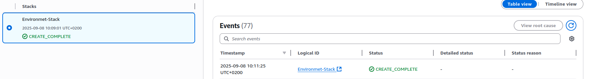
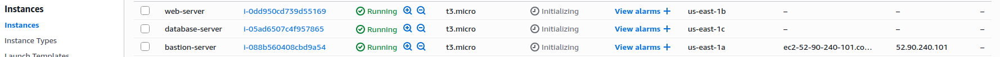
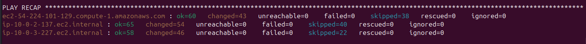
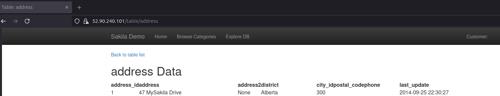

This project is similar to project1-ansible.The difference is it will create servers on AWS.
Everything is automated.CloudFormation will create basic requirements for project.Ansible will set up 3 servers.Bastion server,Web server,Database server with services :
- sshd
- firewall
- chrony
- httpd 
- nginx
- suricata
- fail2ban
- mariadb
- cron
- sysctl
- apparmor
- AIDE

Bastion server ( Ubuntu ) with reverse proxy that forwards connections to webserver.

Web server ( RedHat 9 ) has some basic web application set up which I found online (Its not working fully but it does the job).
Application is hosted with httpd and connects to database.

Database server ( RedHat 9 ) has mariadb set up with sakila database.

Storage role is commented out because VDO requires more ram than free tier instances provide.
fatal: [ip-10-0-3-201.eu-north-1.compute.internal]: FAILED! => {"changed": false, "err": "  Not enough free memory for VDO target. 449.00 MiB RAM is required, but only 378.00 MiB RA>
Password is not created for the user.You can change that by editing adduser-role

Step 1.
Python environment has to be set up with ansible-navigator and ansible-builder installed.
You have to have aws account.Generate session token and populate ansible-navigator.yaml. 
aws sts get-session-token \
  --serial-number arn:aws:iam::123456789012:mfa/name-of-device \
  --token-code 123456
Dont forget to replace aws-key.pem with your aws key and change all inventory/group_vars vars if you change the name or path of the key.

Step 2.
Create AWS CloudFormation stack using aws console or aws cli.
The region in which you created a stack has to be same as the region specified in inventory files.

Step 3.
Create ansible-ee image with tag and container engine you are using ( docker,podman...).
Change the name of image and container engine in ansible-navigator.yaml ( Dont forget to modify AWS section ).
Execute ansible-navigator run playbooks/main.yaml

Step 4.
To clean up just delete the stack you created

After ansible finishes you will only be able to log in to servers using user and port specified in playbook/vars/main.yaml with key ./project-key
You will only be able to access webserver and database through bastion server.All ssh keys are project specific.

